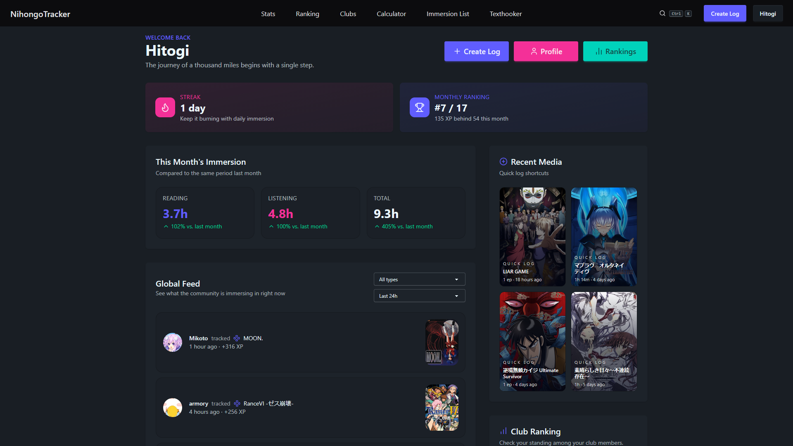
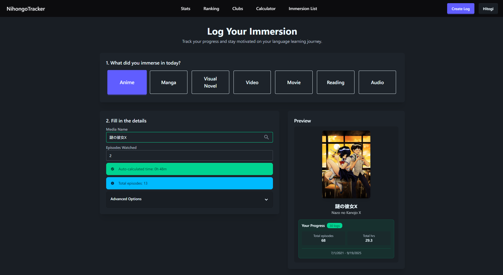
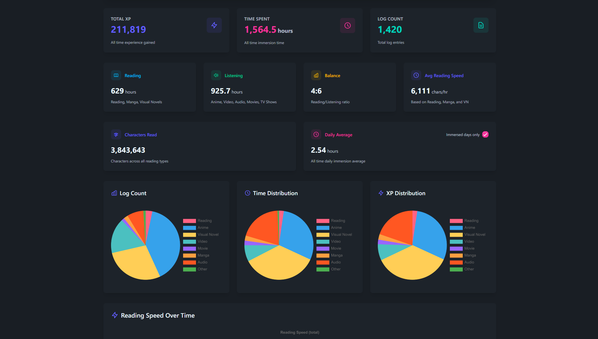
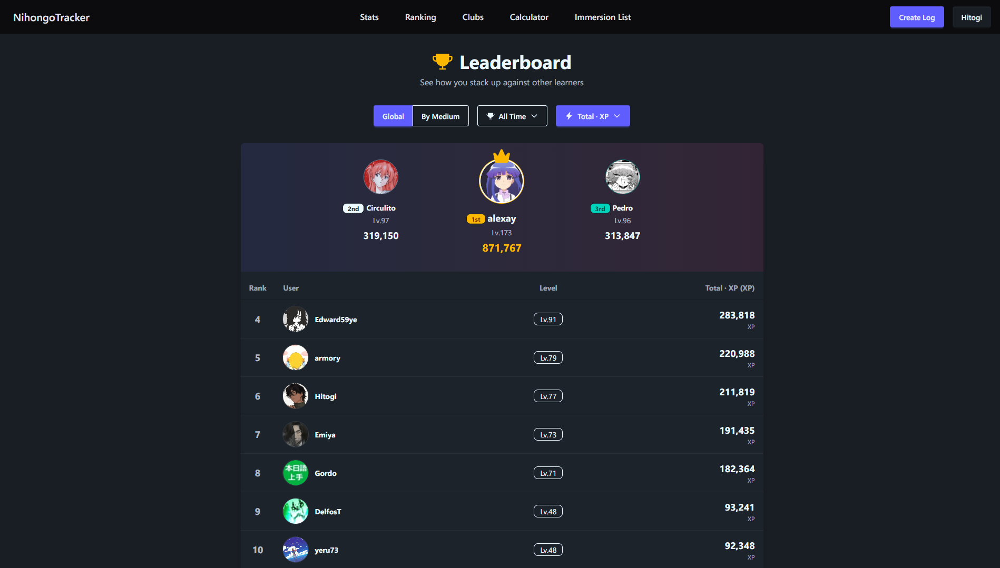
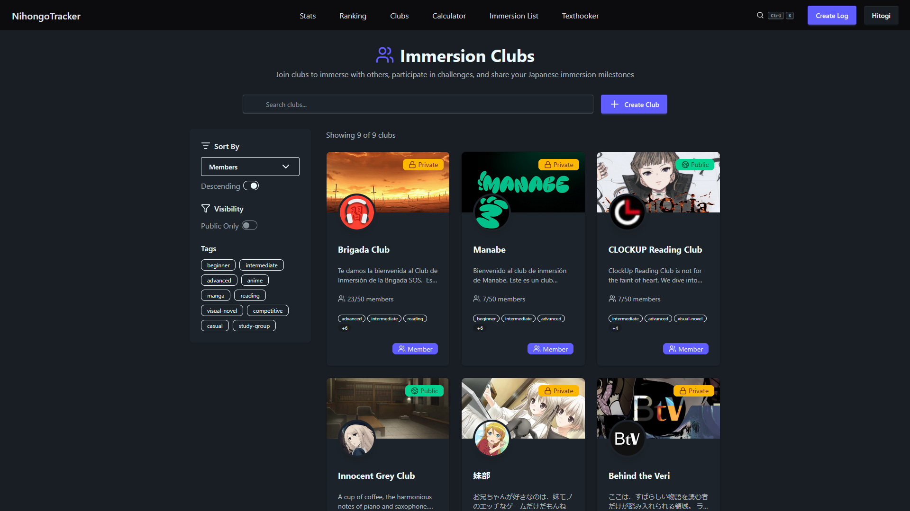

# NihongoTracker · [](https://www.typescriptlang.org/) [](https://reactjs.org/) [](https://nodejs.org/) [](https://www.mongodb.com/) [](https://www.patreon.com/nihongotracker)

A comprehensive Japanese immersion tracker that gamifies your language learning journey. Track progress across anime, manga, visual novels, reading, videos, and audio. Compete with friends, visualize improvement, and stay motivated.

---

## Screenshots

### Dashboard



*Main dashboard showing your recent activity and progress overview*

### Log Tracking



*Track your immersion across multiple media types*

### Stats



*Detailed charts and statistics for your learning journey*

### Leaderboards



*Compete with other learners globally*

### Clubs



*Join or create clubs with your friends*

---

## Features

### Immersion Tracking

- Track anime, manga, visual novels, books, videos, and audio
- Log episodes watched, pages read, character counts, and time spent
- Assign logs to specific media from AniList, VNDB, and YouTube
- Smart grouping of logs for easy media assignment

### Gamification

- XP & leveling system for reading and listening
- Daily streak tracking
- Leaderboards and achievements

### Statistics & Analytics

- Reading speed (characters/hour), total immersion time, progress trends
- Interactive charts and monthly comparisons
- Media breakdown by content type

### Platform Integration

- AniList sync for anime/manga
- VNDB integration for visual novels
- YouTube support for Japanese content

### Social Features

- Public profiles and privacy controls
- Friend system and leaderboards
- Media matcher for collaborative log assignment

## Technology Stack

### Frontend

- React 18 + TypeScript
- React Router
- TanStack Query
- Tailwind CSS + DaisyUI
- Zustand for state management
- Chart.js for data visualization
- Vite for build tooling

### Backend

- Node.js + Express
- TypeScript
- MongoDB + Mongoose
- JWT authentication
- bcrypt for password hashing
- GraphQL for external APIs
- Firebase for file storage

## Getting Started

### Prerequisites

- Node.js 20+
- MongoDB
- Firebase (for file storage)
- API keys for AniList, VNDB, YouTube (optional)

### Installation

1. Clone the repository

   ```bash
   git clone https://github.com/HitogiDev/NihongoTracker.git
   cd NihongoTracker
   ```

2. **Install with Docker (recommended for production or easy setup)**

   ```bash
   # Build and start all services (backend, frontend, MongoDB)
   docker compose up --build
   ```

   - Edit `.env` files as needed before running.
   - The app will be available at [http://localhost:5173](http://localhost:5173) (or the port specified in your Docker config).

3. **Manual Setup (for development)**

   Backend Setup

   ```bash
   cd Backend
   npm install
   cp .env.example .env
   # Edit .env with your configuration
   npm run dev
   ```

   Frontend Setup

   ```bash
   cd Frontend
   npm install
   npm run dev
   ```

4. Environment Variables

   Backend `.env`:

   ```env
   PORT=5000
   TOKEN_SECRET=your_jwt_secret
   DATABASE_URL=mongodb://localhost:27017/nihongotracker
   FIREBASE_API_KEY=your_firebase_key
   FIREBASE_PROJECT_ID=your_project_id
   YOUTUBE_API_KEY=your_youtube_key
   NODE_ENV=development
   ```

### Usage

1. Register an account
2. Start logging immersion activities
3. Assign media to logs
4. View stats and charts
5. Compete on leaderboards

## API Endpoints

### Authentication

- `POST /api/auth/register` - Register
- `POST /api/auth/login` - Login
- `POST /api/auth/logout` - Logout

### Logs

- `GET /api/logs` - Get logs
- `POST /api/logs` - Create log
- `DELETE /api/logs/:id` - Delete log
- `POST /api/logs/assign` - Assign media

### Media

- `GET /api/search/:type` - Search media
- `GET /api/media/:type/:id` - Media details

### Users

- `GET /api/users/:username` - User profile
- `GET /api/users/:username/stats` - User stats
- `GET /api/ranking` - Leaderboards

## Contributing

We welcome contributions! Please see our contributing guidelines.

### Development Setup

1. Fork the repository
2. Create a feature branch
3. Make changes and add tests
4. Submit a pull request

### Code Style

- ESLint and Prettier config provided
- Use TypeScript
- Follow naming conventions

## License

ISC License. See LICENSE for details.

## Support

If you have issues or questions:

- Check Issues page
- Create a new issue
