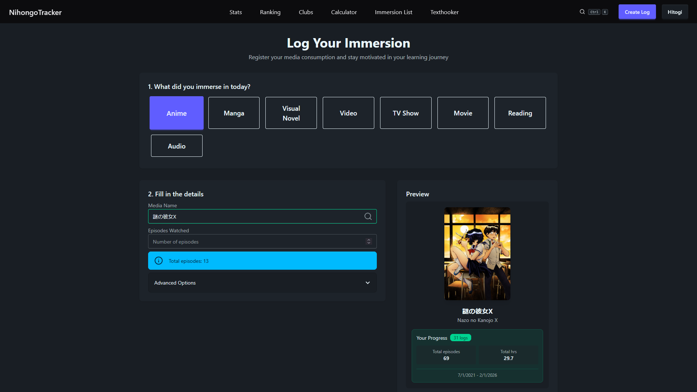
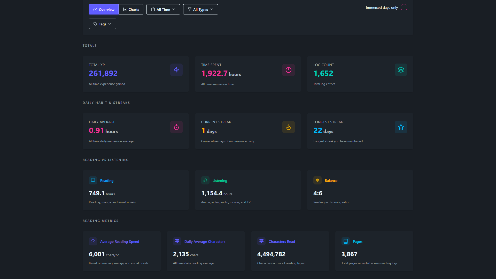
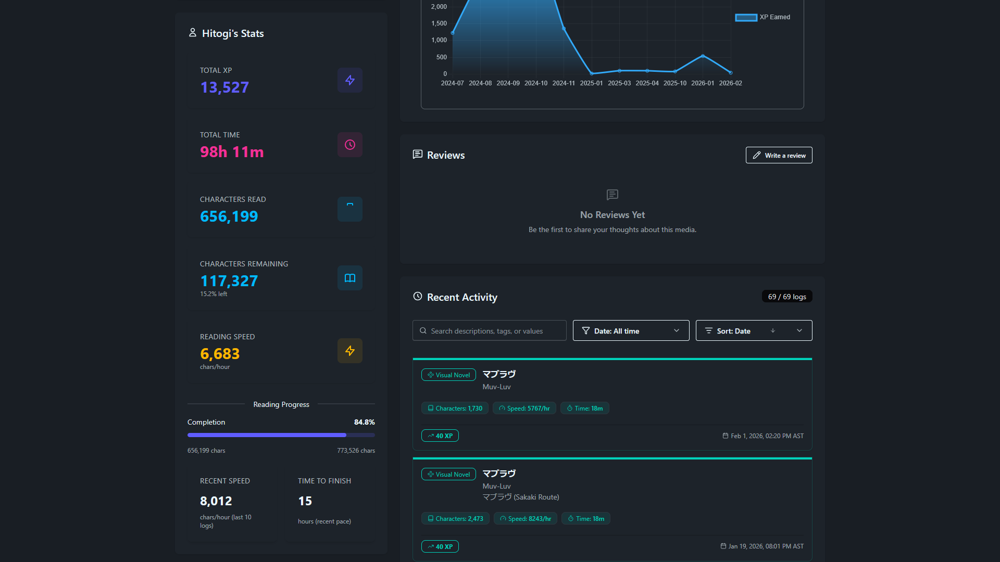
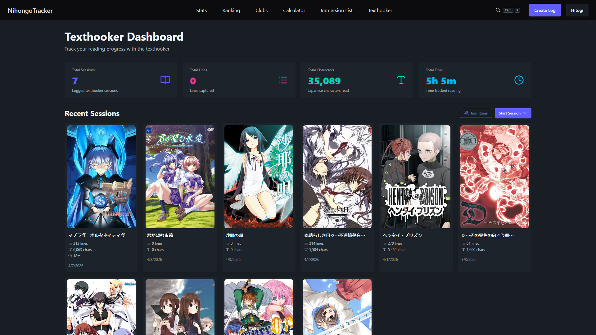
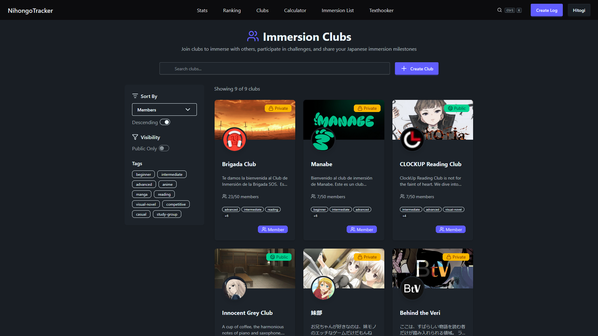

# 🇯🇵 NihongoTracker

**Transform your Japanese immersion into a game**

[](https://www.typescriptlang.org/)
[](https://reactjs.org/)
[](https://nodejs.org/)
[](https://www.mongodb.com/)
[](LICENSE)
[](https://www.patreon.com/nihongotracker)

A Japanese immersion tracker with auto-complete and focused on ease of use, gamification and competitiveness.
Earn XP, level up, maintain streaks, and compete on leaderboards while immersing in Japanese.

---

## Table of Contents

- [Screenshots](#screenshots)
- [Technology Stack](#technology-stack)
- [Getting Started](#getting-started)
  - [Prerequisites](#prerequisites)
  - [Docker Setup (Recommended)](#docker-setup-recommended)
  - [Manual Setup](#manual-setup-for-development)
  - [Environment Variables](#environment-variables)
- [Support](#support)
- [License](#license)

---

## Screenshots

All screenshots below are in the dark theme.

### Dashboard


*Main dashboard showing your recent activity, a feed and some useful stats*

### Log Tracking



*Track your immersion across multiple media types with autocomplete*

### Stats



*Detailed charts and stats of your immersion*

### Media Stats



*Media-specific breakdowns and progress analytics*

### TextHooker



*Texthooker to easily log your visual novel immersion with one click*

### Leaderboards


*Compete with other immersion learners*

### Clubs



*Join or create immersion clubs*

---

## Technology Stack

### Frontend

- **Framework:** React 19 + TypeScript 5
- **Routing:** React Router v6
- **State Management:** Zustand + TanStack Query
- **Styling:** Tailwind CSS v4 + DaisyUI v5
- **Charts:** Chart.js / Recharts
- **Realtime:** Socket.IO client + WebSocket text capture
- **Build Tool:** Vite

### Backend

- **Runtime:** Node.js 18+ (20+ recommended)
- **Framework:** Express.js + TypeScript
- **Database:** MongoDB + Mongoose
- **Authentication:** JWT + bcrypt
- **Realtime:** Socket.IO
- **Search:** Meilisearch
- **File Storage:** Firebase Storage
- **External APIs:** GraphQL (AniList), REST (VNDB, YouTube)

---

## Getting Started

### Prerequisites

- **Node.js** 18 or higher (20+ recommended)
- **MongoDB** 6.0+ (local or Atlas)
- **Firebase** account (for file storage)
- **API Keys** (optional): AniList, VNDB, YouTube

### Docker Setup (Recommended)

You can use the prebuilt docker images for more ease.

#### Requirements

- **Docker Engine** 24+
- **Docker Compose plugin** (or `docker compose` support)

#### Quick Start

```bash
# Clone the repository
git clone https://github.com/HitogiDev/NihongoTracker.git
cd NihongoTracker

# Copy and configure environment variables
cp Backend/.env.example Backend/.env
# Edit Backend/.env with your configuration

# Pull latest images (optional but recommended)
docker compose pull

# Start app + MongoDB + Meilisearch
docker compose up -d
```

For Docker, make sure these values are correct in `Backend/.env`:

```env
DATABASE_URL=mongodb://mongo:27017/nihongotracker
BACKEND_URL=http://localhost:3000
FRONTEND_URL=http://localhost:3000
```

Services will be available at:

- **App + API:** `http://localhost:3000`
- **Meilisearch:** `http://localhost:7700`
- **MongoDB:** `mongodb://localhost:27017`

#### Optional: Run Production Index Migration

```bash
docker compose --profile migration up migration
```

#### Optional: Use nginx external network compose

If you're running behind an existing nginx reverse proxy network:

```bash
docker network create nginx_default
docker compose -f docker-compose.nginx.yml up -d
```

### Manual Setup (for Development)

#### Backend Setup

```bash
cd Backend
npm install

# Configure environment
cp .env.example .env
# Edit .env with your settings (see Environment Variables below)

# Start development server
npm run dev
```

The API server runs on `http://localhost:3000` by default.

#### Frontend Setup

```bash
cd Frontend
npm install

# Start Vite dev server
npm run dev
```

The frontend runs on `http://localhost:5173` with HMR enabled.

#### Production Build

```bash
# Build frontend
cd Frontend
npm run build

# Build backend and copy frontend assets
cd ../Backend
npm run build:frontend  # Copies Frontend/dist to Backend/dist
npm run build           # Compile TypeScript

# Start production server
npm start
```

In production, Express serves both the API and static frontend from a single server.

### Environment Variables

Create a `Backend/.env` file with the following variables:

| Variable                        | Required | Description                                                           |
| ------------------------------- | -------- | --------------------------------------------------------------------- |
| `PORT`                          | No       | Server port (default: 3000)                                           |
| `NODE_ENV`                      | No       | `development` or `production`                                         |
| `TOKEN_SECRET`                  | **Yes**  | JWT signing secret (use a secure random string)                       |
| `DATABASE_URL`                  | **Yes**  | MongoDB connection string                                             |
| `PROD_DOMAIN`                   | No       | Production domain used for app links and metadata                     |
| `BACKEND_URL`                   | No       | Backend base URL (default local: `http://localhost:3000`)             |
| `FRONTEND_URL`                  | No       | Frontend base URL (default local: `http://localhost:5173`)            |
| `FIREBASE_API_KEY`              | **Yes**  | Firebase API key                                                      |
| `FIREBASE_AUTH_DOMAIN`          | **Yes**  | Firebase auth domain                                                  |
| `FIREBASE_PROJECT_ID`           | **Yes**  | Firebase project ID                                                   |
| `FIREBASE_STORAGE_BUCKET`       | **Yes**  | Firebase storage bucket                                               |
| `FIREBASE_MESSAGING_SENDER_ID`  | **Yes**  | Firebase messaging sender ID                                          |
| `FIREBASE_APP_ID`               | **Yes**  | Firebase app ID                                                       |
| `FIREBASE_MEASUREMENT_ID`       | No       | Firebase analytics measurement ID                                     |
| `YOUTUBE_API_KEY`               | No       | YouTube Data API key (for video metadata)                             |
| `JITEN_API_URL`                 | No       | Dictionary API URL used by text tooling                               |
| `MANABE_API_URL`                | No       | Manabe integration base URL                                           |
| `MANABE_WEBHOOK_TOKEN`          | No       | Shared token for Manabe webhook imports                               |
| `PATREON_CLIENT_ID`             | No       | Patreon OAuth client ID                                               |
| `PATREON_CLIENT_SECRET`         | No       | Patreon OAuth client secret                                           |
| `PATREON_WEBHOOK_SECRET`        | No       | Patreon webhook verification secret                                   |
| `PATREON_CREATOR_ACCESS_TOKEN`  | No       | Patreon creator access token                                          |
| `PATREON_CAMPAIGN_ID`           | No       | Patreon campaign ID                                                   |
| `MAILTRAP_TOKEN`                | No       | Mailtrap API token for transactional email                            |
| `MAILTRAP_INBOX_DOMAIN`         | No       | Mailtrap inbox domain                                                 |
| `MEILISEARCH_HOST`              | No       | Meilisearch host URL                                                  |
| `MEILISEARCH_API_KEY`           | No       | Meilisearch admin/search API key                                      |

**Example `.env` file:**

```env
PORT=3000
NODE_ENV=development
TOKEN_SECRET=your-super-secret-jwt-key-change-this
DATABASE_URL=mongodb://localhost:27017/nihongotracker
BACKEND_URL=http://localhost:3000
FRONTEND_URL=http://localhost:5173

# Firebase Configuration
FIREBASE_API_KEY=AIza...
FIREBASE_AUTH_DOMAIN=your-project.firebaseapp.com
FIREBASE_PROJECT_ID=your-project-id
FIREBASE_STORAGE_BUCKET=your-project.appspot.com
FIREBASE_MESSAGING_SENDER_ID=123456789012
FIREBASE_APP_ID=1:123456789012:web:abcdef123456

# Optional: External APIs
YOUTUBE_API_KEY=your-youtube-api-key

# Optional: Search
MEILISEARCH_HOST=http://localhost:7700
MEILISEARCH_API_KEY=your-meilisearch-key
```

---

## Support

Need help or have questions?

- Check the [Issues](https://github.com/HitogiDev/NihongoTracker/issues) page
- [Report a bug](https://github.com/HitogiDev/NihongoTracker/issues/new?template=bug_report.md)
- [Request a feature](https://github.com/HitogiDev/NihongoTracker/issues/new?template=feature_request.md)
- Support development on [Patreon](https://www.patreon.com/nihongotracker)

---

## Acknowledgements

- [Jiten](https://github.com/Sirush/Jiten) - Difficulty and character count.
- [Texthooker-ui](https://github.com/Renji-XD/texthooker-ui) - Texthooker inspiration.
- [VNDB](https://vndb.org/) - Visual Novel data.
- [Anilist](https://anilist.co/) - Anime, manga and light novels data.

---

## License

This project is licensed under the **ISC License** — see the [LICENSE](LICENSE) file for details.

---

**Built with ❤️ for Japanese learners worldwide**

⭐ Star this repo if NihongoTracker helps your learning journey!
