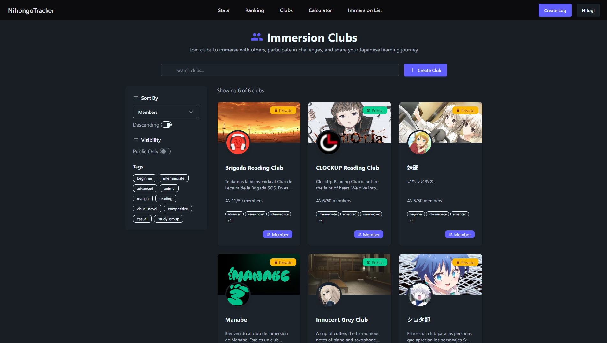

# 🇯🇵 NihongoTracker

**Transform your Japanese immersion into a game**

[](https://www.typescriptlang.org/)
[](https://reactjs.org/)
[](https://nodejs.org/)
[](https://www.mongodb.com/)
[](LICENSE)
[](https://www.patreon.com/nihongotracker)

Track your anime, manga, visual novels, books, videos, and audio immersion. Earn XP, level up, maintain streaks, and compete on leaderboards—all while mastering Japanese.

[**Live Demo**](https://nihongotracker.com) · [**Report Bug**](https://github.com/HitogiDev/NihongoTracker/issues) · [**Request Feature**](https://github.com/HitogiDev/NihongoTracker/issues)

---

## 📑 Table of Contents

- [Screenshots](#-screenshots)
- [Features](#-features)
- [Technology Stack](#-technology-stack)
- [Getting Started](#-getting-started)
  - [Prerequisites](#prerequisites)
  - [Docker Setup (Recommended)](#docker-setup-recommended)
  - [Manual Setup](#manual-setup-for-development)
  - [Environment Variables](#environment-variables)
- [API Reference](#-api-reference)
- [Project Structure](#-project-structure)
- [Contributing](#-contributing)
- [Support](#-support)
- [License](#-license)

---

## 📸 Screenshots

### Dashboard


*Main dashboard showing your recent activity and progress overview*

### Log Tracking


*Track your immersion across multiple media types*

### Stats


*Detailed charts and statistics for your learning journey*

### Leaderboards


*Compete with other learners globally*

### Clubs



*Join or create clubs with your friends*

---

## ✨ Features

### 📚 Comprehensive Immersion Tracking

| Media Type        | What You Can Track                   |
| ----------------- | -------------------------------------|
| **Anime**         | Episodes watched, time spent         |
| **Manga**         | Chapters, pages read                 |
| **Visual Novels** | Characters read, playtime            |
| **Books/Reading** | Pages, characters, reading time      |
| **Videos**        | YouTube content, watch time          |
| **Audio**         | Podcasts, audiobooks, listening time |

- **Smart Media Integration** — Automatically fetch metadata from AniList, VNDB, and YouTube
- **Flexible Logging** — Log by time, characters, pages, or episodes
- **Bulk Assignment** — Group and assign multiple logs to media at once

### 🎮 Gamification System

- **Dual XP System** — Separate tracks for reading and listening skills
- **Dynamic Leveling** — Progress through levels with increasing XP requirements
- **Daily Streaks** — Build consistency with streak tracking (timezone-aware!)
- **Achievements** — Unlock badges for milestones and accomplishments
- **Leaderboards** — Compete globally or within your friend circle

### 📊 Powerful Analytics

- **Reading Speed Metrics** — Track characters/hour improvements over time
- **Interactive Charts** — Visualize your progress with beautiful graphs
- **Monthly Comparisons** — See how you stack up against previous months
- **Media Breakdown** — Understand your immersion distribution by type
- **Goal Tracking** — Set daily and long-term goals with progress indicators

### 🌐 Platform Integrations

| Platform    | Features                                        |
| ----------- | ----------------------------------------------- |
| **AniList** | Sync anime/manga progress, import watch history |
| **VNDB**    | Visual novel metadata and tracking              |
| **YouTube** | Japanese video content logging                  |

### 👥 Social Features

- **Public Profiles** — Showcase your immersion journey
- **Privacy Controls** — Choose what others can see
- **Clubs** — Create or join communities with shared goals
- **Friends System** — Follow other learners and compare progress

---

## 🛠 Technology Stack

### Frontend

- **Framework:** React 18 + TypeScript
- **Routing:** React Router v6
- **State Management:** Zustand + TanStack Query
- **Styling:** Tailwind CSS + DaisyUI
- **Charts:** Chart.js / Recharts
- **Build Tool:** Vite

### Backend

- **Runtime:** Node.js 20+
- **Framework:** Express.js + TypeScript
- **Database:** MongoDB + Mongoose
- **Authentication:** JWT + bcrypt
- **File Storage:** Firebase Storage
- **External APIs:** GraphQL (AniList), REST (VNDB, YouTube)

---

## 🚀 Getting Started

### Prerequisites

- **Node.js** 20 or higher
- **MongoDB** 6.0+ (local or Atlas)
- **Firebase** account (for file storage)
- **API Keys** (optional): AniList, VNDB, YouTube

### Docker Setup (Recommended)

The fastest way to get NihongoTracker running:

```bash
# Clone the repository
git clone https://github.com/HitogiDev/NihongoTracker.git
cd NihongoTracker

# Copy and configure environment variables
cp Backend/.env.example Backend/.env
# Edit Backend/.env with your configuration

# Build and start all services
docker compose up --build
```

The app will be available at `http://localhost:5173`

### Manual Setup (for Development)

#### Backend Setup

```bash
cd Backend
npm install

# Configure environment
cp .env.example .env
# Edit .env with your settings (see Environment Variables below)

# Start development server with hot reload
npm run dev
```

The API server runs on `http://localhost:3000` by default.

#### Frontend Setup

```bash
cd Frontend
npm install

# Start Vite dev server
npm run dev
```

The frontend runs on `http://localhost:5173` with HMR enabled.

#### Production Build

```bash
# Build frontend
cd Frontend
npm run build

# Build backend and copy frontend assets
cd ../Backend
npm run build:frontend  # Copies Frontend/dist to Backend/dist
npm run build           # Compile TypeScript

# Start production server
npm start
```

In production, Express serves both the API and static frontend from a single server.

### Environment Variables

Create a `Backend/.env` file with the following variables:

| Variable                  | Required | Description                                     |
| ------------------------- | -------- | ----------------------------------------------- |
| `PORT`                    | No       | Server port (default: 3000)                     |
| `NODE_ENV`                | No       | `development` or `production`                   |
| `TOKEN_SECRET`            | **Yes**  | JWT signing secret (use a secure random string) |
| `DATABASE_URL`            | **Yes**  | MongoDB connection string                       |
| `FIREBASE_API_KEY`        | **Yes**  | Firebase API key                                |
| `FIREBASE_PROJECT_ID`     | **Yes**  | Firebase project ID                             |
| `FIREBASE_STORAGE_BUCKET` | **Yes**  | Firebase storage bucket                         |
| `YOUTUBE_API_KEY`         | No       | YouTube Data API key (for video metadata)       |
| `ANILIST_CLIENT_ID`       | No       | AniList OAuth client ID                         |
| `ANILIST_CLIENT_SECRET`   | No       | AniList OAuth client secret                     |

**Example `.env` file:**

```env
PORT=3000
NODE_ENV=development
TOKEN_SECRET=your-super-secret-jwt-key-change-this
DATABASE_URL=mongodb://localhost:27017/nihongotracker

# Firebase Configuration
FIREBASE_API_KEY=AIza...
FIREBASE_PROJECT_ID=your-project-id
FIREBASE_STORAGE_BUCKET=your-project.appspot.com

# Optional: External APIs
YOUTUBE_API_KEY=your-youtube-api-key
```

---

## 📖 API Reference

Base URL: `/api`

### Authentication API

| Method | Endpoint         | Description                  |
| ------ | ---------------- | ---------------------------- |
| `POST` | `/auth/register` | Create a new account         |
| `POST` | `/auth/login`    | Authenticate and receive JWT |
| `POST` | `/auth/logout`   | Invalidate session           |
| `GET`  | `/auth/me`       | Get current user info        |

### Logs API

| Method   | Endpoint       | Description                       |
| -------- | -------------- | --------------------------------- |
| `GET`    | `/logs`        | Get user's logs (paginated)       |
| `POST`   | `/logs`        | Create a new immersion log        |
| `PATCH`  | `/logs/:id`    | Update an existing log            |
| `DELETE` | `/logs/:id`    | Delete a log                      |
| `POST`   | `/logs/assign` | Assign media to logs              |
| `POST`   | `/logs/import` | Import logs from external sources |

### Media API

| Method | Endpoint           | Description                           |
| ------ | ------------------ | ------------------------------------- |
| `GET`  | `/search/:type`    | Search media (anime, manga, vn, etc.) |
| `GET`  | `/media/:type/:id` | Get media details                     |

### Users & Stats API

| Method  | Endpoint                 | Description             |
| ------- | ------------------------ | ----------------------- |
| `GET`   | `/users/:username`       | Get user profile        |
| `GET`   | `/users/:username/stats` | Get user statistics     |
| `PATCH` | `/users/settings`        | Update user settings    |
| `GET`   | `/ranking`               | Get global leaderboards |

### Goals API

| Method | Endpoint          | Description              |
| ------ | ----------------- | ------------------------ |
| `GET`  | `/goals/daily`    | Get daily goals          |
| `POST` | `/goals/daily`    | Create/update daily goal |
| `GET`  | `/goals/longterm` | Get long-term goals      |
| `POST` | `/goals/longterm` | Create long-term goal    |

### Clubs API

| Method | Endpoint           | Description       |
| ------ | ------------------ | ----------------- |
| `GET`  | `/clubs`           | List all clubs    |
| `POST` | `/clubs`           | Create a new club |
| `GET`  | `/clubs/:id`       | Get club details  |
| `POST` | `/clubs/:id/join`  | Join a club       |
| `POST` | `/clubs/:id/leave` | Leave a club      |

---

## 📁 Project Structure

```text
NihongoTracker/
├── Backend/
│   ├── src/
│   │   ├── controllers/     # Route handlers
│   │   ├── middlewares/     # Express middleware (auth, XP calc, etc.)
│   │   ├── models/          # Mongoose schemas
│   │   ├── routes/          # API route definitions
│   │   ├── services/        # Business logic & external APIs
│   │   ├── libs/            # Utilities (JWT, auth helpers)
│   │   ├── types.ts         # TypeScript interfaces
│   │   └── app.ts           # Express app configuration
│   ├── build/               # Compiled JavaScript output
│   └── dist/                # Frontend assets (production)
│
├── Frontend/
│   ├── src/
│   │   ├── api/             # API client functions
│   │   ├── components/      # Reusable UI components
│   │   ├── screens/         # Page components
│   │   ├── store/           # Zustand state stores
│   │   ├── hooks/           # Custom React hooks
│   │   ├── contexts/        # React contexts
│   │   └── utils/           # Helper functions
│   └── public/              # Static assets
│
├── docker-compose.yml       # Docker orchestration
└── README.md
```

---

## 🤝 Contributing

Contributions are welcome! Whether it's bug fixes, new features, or documentation improvements.

### Development Workflow

1. **Fork** the repository
2. **Clone** your fork locally
3. **Create** a feature branch: `git checkout -b feature/amazing-feature`
4. **Make** your changes
5. **Test** thoroughly
6. **Commit** with clear messages: `git commit -m "feat: add amazing feature"`
7. **Push** to your fork: `git push origin feature/amazing-feature`
8. **Open** a Pull Request

### Code Guidelines

- **TypeScript** — All code must be typed
- **ES Modules** — Use `.js` extensions in imports (TypeScript compiles to ESM)
- **Formatting** — Run Prettier before committing
- **Naming** — Use camelCase for variables/functions, PascalCase for components/classes

### Commit Convention

We follow [Conventional Commits](https://www.conventionalcommits.org/):

- `feat:` — New features
- `fix:` — Bug fixes
- `docs:` — Documentation changes
- `style:` — Code style changes (formatting, etc.)
- `refactor:` — Code refactoring
- `test:` — Adding or updating tests
- `chore:` — Maintenance tasks

---

## 💬 Support

Need help or have questions?

- 📖 Check the [Issues](https://github.com/HitogiDev/NihongoTracker/issues) page
- 🐛 [Report a bug](https://github.com/HitogiDev/NihongoTracker/issues/new?template=bug_report.md)
- 💡 [Request a feature](https://github.com/HitogiDev/NihongoTracker/issues/new?template=feature_request.md)
- ☕ Support development on [Patreon](https://www.patreon.com/nihongotracker)

---

## 📄 License

This project is licensed under the **ISC License** — see the [LICENSE](LICENSE) file for details.

---

**Built with ❤️ for Japanese learners worldwide**

⭐ Star this repo if NihongoTracker helps your learning journey!
